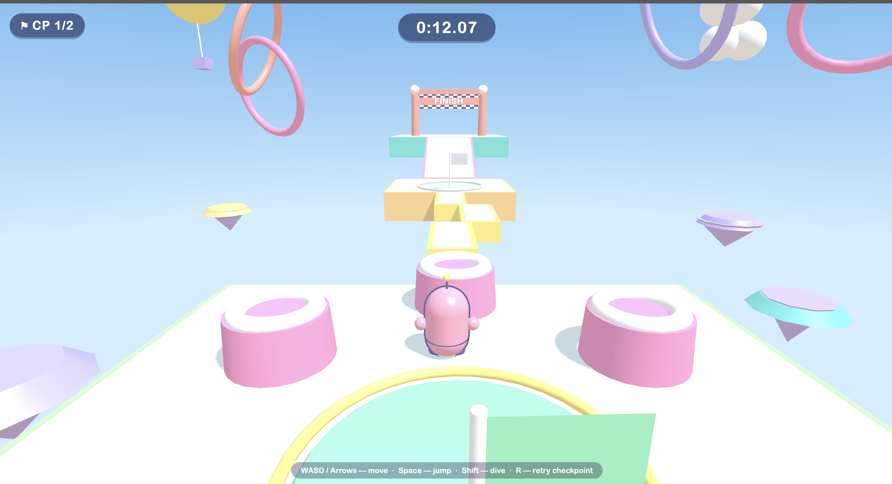
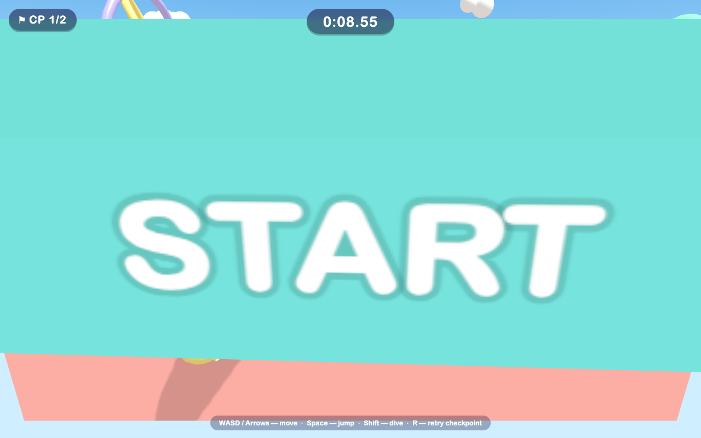
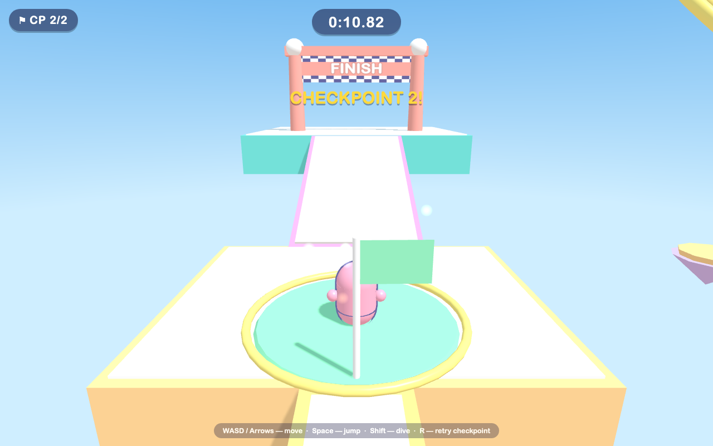
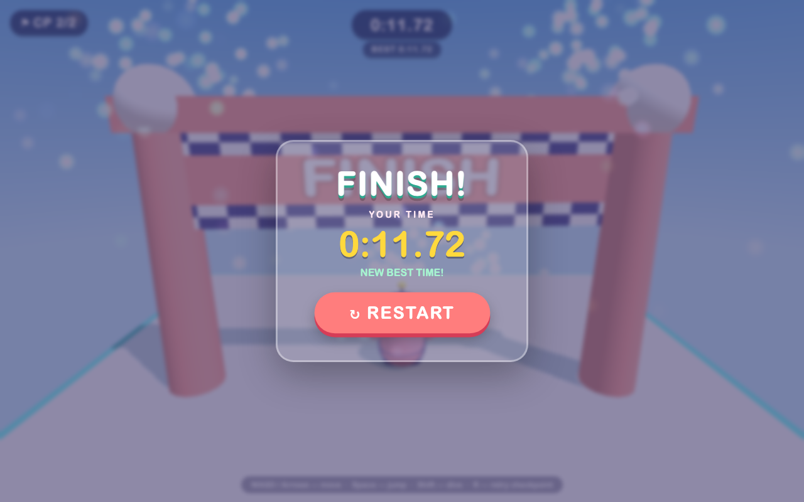

# Wobble Rush 3D

A bright, toy-like 3D obstacle-course game in the browser, inspired by
party-royale obstacle courses but with fully original art, characters and
level design. Built with Three.js (r128, vendored locally) and plain
HTML/CSS/JavaScript — no build step.









## Run it

Just open `index.html` in a browser (double-click works — no server needed).

Optionally, serve it instead:

```sh
cd wobble-rush-3d
python3 -m http.server 8000
# then open http://localhost:8000
```

## Controls

| Input            | Action                    |
| ---------------- | ------------------------- |
| `W A S D` / arrows | Move                    |
| `Space`          | Jump (coyote time + input buffer) |
| `Shift`          | Dive / boost forward      |
| `R`              | Respawn at last checkpoint |
| `Enter`          | Start / restart           |

Reach the FINISH gate as fast as you can. Falling off the course respawns
you at the latest checkpoint. Your best time is saved in `localStorage`.

## The course

Start platform → twin rotating sweeper bars → three moving platforms
(side-to-side, vertical, forward-back) → checkpoint island with bouncing
bumpers → narrow zigzag bridge → checkpoint island → ramp up to the
finish gate.

## Code layout

```
index.html          page + UI overlays, loads scripts in order
css/style.css       HUD, screens, animations
vendor/three.min.js Three.js r128 (UMD build so file:// works)
js/utils.js         shared math helpers + time formatting
js/audio.js         procedural WebAudio sound effects (no assets)
js/effects.js       pooled particle system (land, checkpoint, dive, respawn, finish…)
js/obstacle.js      Sweeper, MovingPlatform, Bumper
js/checkpoint.js    Checkpoint pads, start/finish Gates
js/course.js        level geometry, colliders, ramp, sky + animated decor
js/player.js        character mesh + arcade movement/collision
js/ui.js            DOM HUD and screens
js/game.js          renderer/camera/input/state machine/timer
js/main.js          boot with explicit load/WebGL error reporting
```

If Three.js or WebGL fails to load, the game shows a clear error overlay
instead of failing silently.
